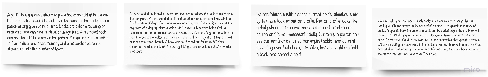
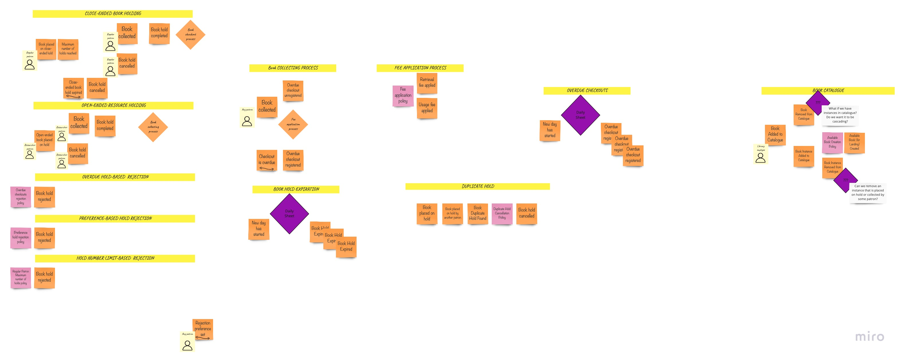
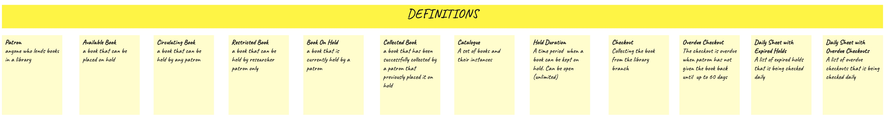
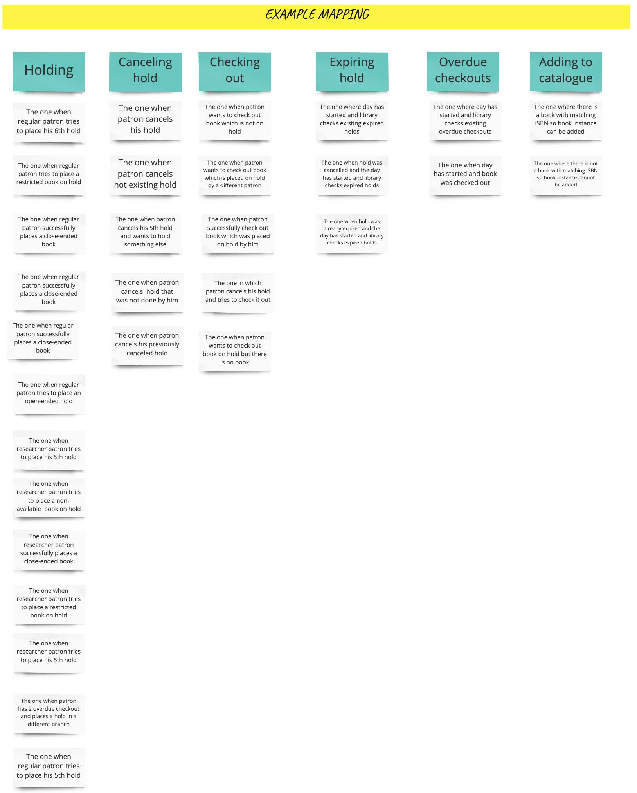
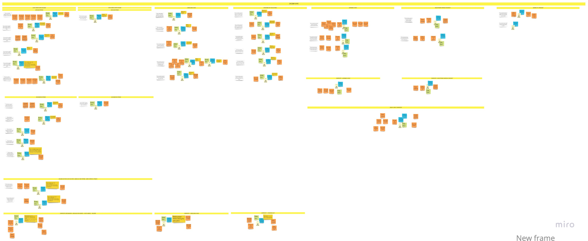
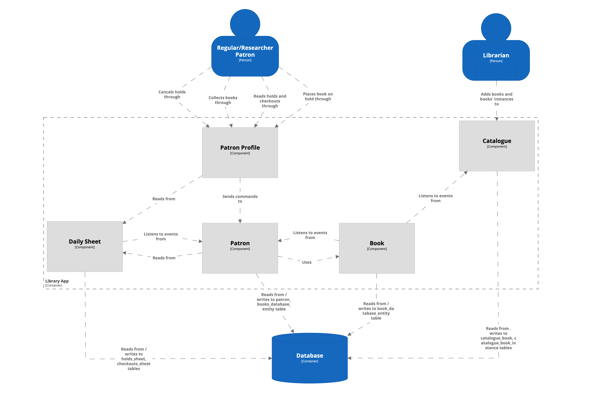

# 도서관 관리 시스템 - TypeScript & NestJS로 구현한 DDD

**도메인 주도 설계 입문자를 위한 실전 학습 자료**

[](https://www.typescriptlang.org/)
[](https://nestjs.com/)
[](LICENSE)

## 목차

- [프로젝트 소개](#프로젝트-소개)
- [DDD 입문자를 위한 안내](#ddd-입문자를-위한-안내)
- [빠른 시작](#빠른-시작)
- [도메인 설명](#도메인-설명)
- [아키텍처 개요](#아키텍처-개요)
    - [왜 헥사고날 아키텍처인가?](#왜-헥사고날-아키텍처인가)
    - [프로젝트 구조](#프로젝트-구조)
    - [Bounded Context](#bounded-context)
- [단계별 구현 가이드](#단계별-구현-가이드)
- [프로세스 발견](#프로세스-발견)
- [NestJS 통합](#nestjs-통합)
- [기여하기](#기여하기)
- [참고 자료](#참고-자료)

---

## 프로젝트 소개

이 프로젝트는 유명한 [ddd-by-examples/library](https://github.com/ddd-by-examples/library) (원본은 Java)를 **TypeScript/NestJS로 재구현**한 것입니다.

**이 프로젝트는 무엇인가요?**
- 도메인 주도 설계(Domain-Driven Design, DDD) 원칙으로 구축된 실전 도서관 관리 시스템
- DDD, Event Storming, 헥사고날 아키텍처를 처음 배우는 개발자를 위한 학습 자료
- TypeScript로 DDD 전술적 패턴(Aggregate, Value Object, Domain Event, Policy)을 적용하는 방법을 보여주는 예제

**원본 프로젝트와의 주요 차이점:**
- **NestJS** 프레임워크 사용 (원본은 Spring)
- **TypeScript**와 **fp-ts**로 함수형 프로그래밍 패턴 구현
- **Nx**를 사용한 모노레포 관리 (모듈식 모노리스)
- **MikroORM**을 사용한 영속성 처리
- Node.js 특유의 제약사항(순환 참조 등) 해결

**프로젝트 상태**: 적극적으로 개발 중입니다. 일부 솔루션은 실험적이며 변경될 수 있습니다.

---

## DDD 입문자를 위한 안내

**도메인 주도 설계가 처음이신가요?** 이 프로젝트는 여러분을 위해 만들어졌습니다!

### 일반적인 CRUD 개발과 DDD의 차이점

| 전통적인 CRUD | DDD 접근 방식 |
|--------------|--------------|
| 데이터베이스 테이블부터 설계 | 비즈니스 문제부터 이해 |
| 엔티티 = 테이블 매핑 | 엔티티 = 비즈니스 규칙을 가진 객체 |
| 모든 로직을 Service에 작성 | 비즈니스 로직은 Domain에, Service는 조율만 |
| DTO → Entity → DB | DTO → Command → Domain → Event → Repository |

### 이 프로젝트에서 배울 수 있는 핵심 DDD 개념:

1. **Value Object** - 값으로 식별되는 불변 객체 (예: `PatronId`, `HoldDuration`)
2. **Entity** - 고유한 식별자를 가진 객체 (예: `AvailableBook`)
3. **Aggregate** - 하나의 단위로 취급되는 객체 묶음 (예: 예약을 관리하는 `Patron`)
4. **Domain Event** - 발생한 중요한 사실 (예: `BookPlacedOnHold`, `BookHoldFailed`)
5. **Policy** - 플러그 가능한 비즈니스 규칙 (예: "일반 이용자는 최대 5권까지 예약 가능")
6. **Bounded Context** - 명확한 경계를 가진 자율적 하위 시스템 (`Lending`, `Catalogue`)

### 이 프로젝트로 DDD를 배워야 하는 이유

- **실제 비즈니스 요구사항**: 장난감 예제가 아닌 실제 도서관 도메인 로직
- **단계별 가이드**: [STEP.md](./STEP.md)에서 완전한 초보자 튜토리얼 제공
- **실용적인 패턴**: DDD 패턴이 실제 문제를 어떻게 해결하는지 확인 (이론만이 아님)
- **최신 기술 스택**: TypeScript, NestJS, 함수형 프로그래밍(fp-ts)으로 DDD 학습
- **테스트 주도**: 광범위한 단위 테스트와 통합 테스트로 비즈니스 규칙 검증 방법 학습

---

## 빠른 시작

### 사전 요구사항

- Node.js 20+
- Docker & Docker Compose (PostgreSQL용)
- pnpm 또는 bun

### 설치 및 실행

```bash
# 1. 저장소 클론
git clone https://github.com/MoonDongmin/library-ddd.git
cd library-nestjs

# 2. 의존성 설치
bun install

# 3. PostgreSQL 데이터베이스 시작
docker-compose up -d

# 4. 데이터베이스 마이그레이션 실행
bunx mikro-orm migration:up

# 5. 애플리케이션 시작
bun start
# 또는
nx serve library

# 6. API 접근
# API는 http://localhost:3000에서 사용 가능
# Swagger 문서는 http://localhost:3000/api
```

### 테스트 실행

```bash
# 모든 테스트 실행
bun test

# 특정 라이브러리 테스트
nx test lending-domain
nx test lending-application

# 커버리지 포함 테스트
nx test lending-domain --coverage

# E2E 테스트
nx e2e library-e2e
```

### API 호출 예제

```bash
# 책 예약하기
curl -X POST http://localhost:3000/lending/holds \
  -H "Content-Type: application/json" \
  -d '{
    "patronId": "patron-123",
    "bookId": "book-456",
    "libraryBranchId": "branch-789",
    "numberOfDays": 5
  }'
```

---

## 도메인 설명

**비즈니스 컨텍스트**: 공공 도서관 관리 시스템

공공 도서관은 이용자(patron)가 다양한 도서관 지점에서 책을 예약할 수 있도록 합니다.
대출 가능한 책은 주어진 시점에 한 명의 이용자만 예약할 수 있습니다.
책은 일반 도서(circulating) 또는 제한 도서(restricted)이며, 반납 수수료나 사용 수수료가 있을 수 있습니다.
제한 도서는 연구자 이용자만 예약할 수 있습니다. 일반 이용자는 주어진 시점에 최대 5권까지만 예약할 수 있지만,
연구자 이용자는 무제한으로 예약할 수 있습니다. 무기한 예약(open-ended hold)은 이용자가 책을 대출할 때까지
활성 상태이며, 대출 시 완료됩니다. 정해진 기간(close-ended) 예약이 요청 후 일정 기간 내에 완료되지 않으면
만료됩니다. 이는 만료되는 예약이 있는 일일 시트(daily sheet)를 확인하여 하루의 시작 시점에 이루어집니다.
연구자 이용자만 무기한 예약 기간을 요청할 수 있습니다. 도서관 지점에서 2회 이상의 연체 대출이 있는 이용자는
동일한 도서관 지점에서 예약을 시도하면 거부됩니다. 책은 최대 60일 동안 대출할 수 있습니다. 연체 대출 확인은
연체 대출이 있는 일일 시트를 확인하여 이루어집니다. 이용자는 프로필(patron profile)을 통해 현재 예약,
대출 등과 상호작용합니다. 이용자 프로필은 일일 시트처럼 보이지만, 정보가 한 명의 이용자로 제한되며
반드시 일일 단위일 필요는 없습니다. 현재 이용자는 현재 예약(취소되거나 만료되지 않은)과 현재 대출(연체 포함)을
볼 수 있습니다. 또한 책을 예약하고 예약을 취소할 수 있습니다.

이용자가 대출 가능한 책을 어떻게 알 수 있을까요? 도서관에는 책과 그 특정 인스턴스가 함께 추가되는 카탈로그가
있습니다. 특정 책 인스턴스는 카탈로그에 일치하는 ISBN이 있는 책이 이미 있는 경우에만 추가할 수 있습니다.
책은 비어 있지 않은 제목과 가격이 있어야 합니다. 인스턴스를 추가할 때 일반 도서인지 제한 도서인지 결정합니다.
이를 통해 동일한 ISBN의 책을 일반 도서와 제한 도서로 동시에 보유할 수 있습니다
(예: 저자가 서명한 책을 제한 도서로 보관하려는 경우).

---

## 아키텍처 개요

### 왜 헥사고날 아키텍처인가?

**Lending** 컨텍스트는 **헥사고날 아키텍처**(Ports & Adapters)를 사용합니다. 다음과 같은 복잡한 비즈니스 로직을 포함하기 때문입니다:
- **프레임워크 독립성**: 도메인 로직이 NestJS, 데이터베이스, HTTP에 의존하지 않음
- **테스트 가능성**: 순수 비즈니스 로직을 외부 의존성 없이 테스트 가능
- **유연성**: 인프라 교체(예: PostgreSQL → MongoDB)가 도메인 코드 수정 없이 가능

**핵심 원칙**: 의존성은 안쪽을 향합니다. Domain이 중심에 있고, 외부 세계를 알지 못합니다.

```
┌─────────────────────────────────────┐
│  UI Layer (ui-rest/)                │  ← HTTP 요청
│  - Controller, DTO                  │
└─────────────────────────────────────┘
           ↓ (Facade 호출)
┌─────────────────────────────────────┐
│  Application Layer (application/)   │  ← 유스케이스 조율
│  - Command, Handler, Port           │
└─────────────────────────────────────┘
           ↓ (Domain 호출)
┌─────────────────────────────────────┐
│  Domain Layer (domain/)             │  ← 핵심 비즈니스 로직
│  - Entity, Value Object, Policy     │
└─────────────────────────────────────┘
           ↑ (Port 구현)
┌─────────────────────────────────────┐
│  Infrastructure Layer (infra/)      │  ← 기술 세부사항
│  - Repository, Database Entity      │
└─────────────────────────────────────┘
```

### 프로젝트 구조

시스템은 Nx 라이브러리를 사용한 **모듈식 모노리스**로 구성됩니다:

```
└── libs/
    ├── catalogue/              # 단순 CRUD 컨텍스트
    │   └── src/
    ├── lending/                # 복잡한 DDD 컨텍스트
    │   ├── domain/             # 비즈니스 로직 (프레임워크 무관)
    │   │   ├── /book
    │   │   ├── /patron
    │   │   └── /policies
    │   ├── application/        # 유스케이스 (CQRS)
    │   ├── infrastructure/     # 영속성 (MikroORM)
    │   └── ui-rest/            # REST API
    └── shared/                 # 공통 유틸리티
```

**이런 구조를 사용하는 이유:**
- 각 Bounded Context가 별도의 라이브러리 → 명확한 경계
- Lending은 헥사고날 레이어 사용 → 복잡한 도메인 로직
- Catalogue는 단순 → 레이어 없는 CRUD
- Nx가 모듈 경계 강제 → 의도치 않은 결합 방지

### Bounded Context

#### 1. **Lending Context** (복잡한 도메인)

**책임**: 비즈니스 규칙을 가진 책 예약 및 대출 관리

**주요 Aggregate:**
- `Patron` - 예약 제한, 연체 확인 강제
- `Book` - 가용성 상태 관리

**주요 Policy:**
- `onlyResearcherCanHoldRestrictedBooks`
- `regularPatronMaximumNumberOfHolds`

**Domain Event:**
- `BookPlacedOnHold`, `BookHoldFailed`, `BookHoldCanceled`, `BookCheckedOut`

#### 2. **Catalogue Context** (단순 CRUD)

**책임**: 도서 카탈로그 및 인스턴스 관리

**작업:**
- 카탈로그에 책 추가
- 책 인스턴스 추가 (일반/제한)
- 대출 가능한 책 조회

---

## 단계별 구현 가이드

**Lending 컨텍스트에 새 기능을 추가하고 싶으신가요?**

처음부터 끝까지 새로운 기능(예: "책 예약하기")을 구현하는 방법을 안내하는 포괄적이고 초보자 친화적인 가이드를 만들었습니다.

**📖 [완전한 가이드 읽기: STEP.md](./STEP.md)**

가이드 내용:
- **0. 설계 단계** - 코딩 전 요구사항 이해
- **1. Domain 레이어** - Value Object, Entity, Aggregate, Policy
- **2. Application 레이어** - Command, Handler, Port
- **3. Infrastructure 레이어** - Repository, Database Entity, Migration
- **4. UI 레이어** - REST Controller, DTO
- **5. 테스팅** - 단위 테스트, 통합 테스트, E2E 테스트

각 단계에는 다음이 포함됩니다:
- ✅ 왜 이렇게 해야 하는지
- ✅ 피해야 할 일반적인 실수
- ✅ 복사할 수 있는 실제 코드 예제
- ✅ 올바르게 했는지 확인하는 체크리스트

---

## 프로세스 발견

### Event Storming

우리가 시작한 첫 번째 작업은 Big Picture EventStorming을 통한 도메인 탐색이었습니다.
이전 장에서 찾은 설명이 우리의 가상 벽에 게시되었습니다:

EventStorming 세션은 많은 발견으로 이어졌고, 포스트잇으로 모델링했습니다:

세션 중에 다음 정의를 발견했습니다:


이를 통해 실제 발생할 수 있는 시나리오를 생각하게 되었습니다. **Example mapping**의 도움으로
발견한 내용을 설명했습니다:


이는 각 예제를 분석한 _Design Level_ 세션의 기초가 되었습니다:


언급된 각 단계에 대한 자세한 내용은 아래 링크를 참조하세요:

- [Big Picture EventStorming](./docs/big-picture.md)
- [Example Mapping](docs/example-mapping.md)
- [Design Level EventStorming](docs/design-level.md)

---

## NestJS 통합

### 프레임워크 철학

Spring 의존성을 최소화한 원본 Java 버전과 달리, 이 구현은 **NestJS를 실용적으로 수용**합니다.

**왜 NestJS인가?**
- 고급 의존성 주입(Dependency Injection) 시스템
- TypeScript 우선 설계
- 내장 CQRS 지원 (`@nestjs/cqrs`)
- 표준화된 모듈 구조
- 활발한 생태계

**DDD 원칙과 프레임워크 실용성의 균형**

Eric Evans가 *Domain-Driven Design*에서 쓴 것처럼:

> 최고의 아키텍처 프레임워크는 도메인 개발자가 모델 표현에 집중할 수 있도록 하면서 복잡한 기술 문제를 해결합니다.
> 그러나 프레임워크는 도메인 설계 선택을 제약하는 너무 많은 가정을 하거나 구현을 너무 무겁게 만들어 개발 속도를
> 늦춤으로써 쉽게 방해가 될 수 있습니다.

**우리의 접근 방식:**

| 레이어 | 프레임워크 사용 | 이유 |
|-------|----------------|------|
| **Domain** | 없음 (순수 TypeScript + fp-ts) | 비즈니스 로직은 프레임워크 독립적이어야 함 |
| **Application** | NestJS CQRS, DI | 도메인을 오염시키지 않고 커맨드/이벤트 처리 단순화 |
| **Infrastructure** | NestJS 모듈, MikroORM | 기술적 관심사에 프레임워크 활용 |
| **UI** | NestJS 컨트롤러, 데코레이터 | 표준 REST API 패턴 |

**예제: Domain을 순수하게 유지하기**

```typescript
// ✅ Domain Layer - 프레임워크 의존성 없음
export class Patron {
  placeOnHold(
    book: AvailableBook,
    duration: HoldDuration
  ): Either<BookHoldFailed, BookPlacedOnHold> {
    // fp-ts를 사용한 순수 비즈니스 로직
    const rejection = this.patronCanHold(book, duration);
    return isNone(rejection)
      ? right(new BookPlacedOnHold(...))
      : left(BookHoldFailed.bookHoldFailedNow(...));
  }
}

// ✅ Application Layer - NestJS를 실용적으로 사용
@CommandHandler(PlaceOnHoldCommand)
export class PlaceOnHoldHandler implements ICommandHandler<PlaceOnHoldCommand> {
  constructor(
    private readonly patronRepository: PatronRepository,
    private readonly eventPublisher: EventPublisher
  ) {}

  async execute(command: PlaceOnHoldCommand): Promise<void> {
    const patron = await this.patronRepository.findById(patronId);
    const result = patron.placeOnHold(book, duration); // 도메인 호출
    // 결과 처리, 이벤트 발행
  }
}
```

**이 접근 방식의 장점:**
- 비즈니스 로직을 다시 작성하지 않고 NestJS를 다른 프레임워크로 교체 가능
- 도메인 테스트가 빠름 (프레임워크 부트스트랩 없음)
- 개발자가 DDD 원칙을 희생하지 않고 NestJS의 생산성 기능 사용 가능

### 추가 구현 세부사항

**컴포넌트 다이어그램:**



**Node.js 제약사항 처리:**

각 비즈니스 객체가 자체 헥사고날 라이브러리를 가진 Java 버전과 달리, 우리는 관련 객체를 레이어별 공유 라이브러리로
병합했습니다. 이는 라이브러리가 서로 많이 의존할 때 Node.js에서 흔한 순환 참조 문제를 피합니다.

---

## 참고 자료

1. [Introducing EventStorming](https://leanpub.com/introducing_eventstorming) by Alberto Brandolini
2. [Domain Modelling Made Functional](https://pragprog.com/book/swdddf/domain-modeling-made-functional) by Scott Wlaschin
3. [Software Architecture for Developers](https://softwarearchitecturefordevelopers.com) by Simon Brown
4. [Clean Architecture](https://www.amazon.com/Clean-Architecture-Craftsmans-Software-Structure/dp/0134494164) by Robert C. Martin
5. [Domain-Driven Design: Tackling Complexity in the Heart of Software](https://www.amazon.com/Domain-Driven-Design-Tackling-Complexity-Software/dp/0321125215) by Eric Evans
